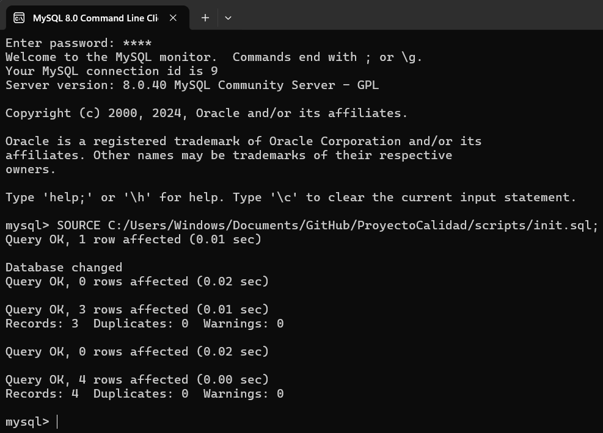
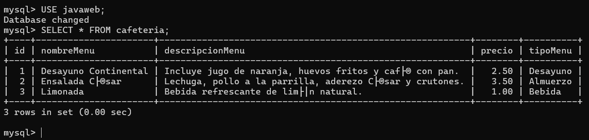
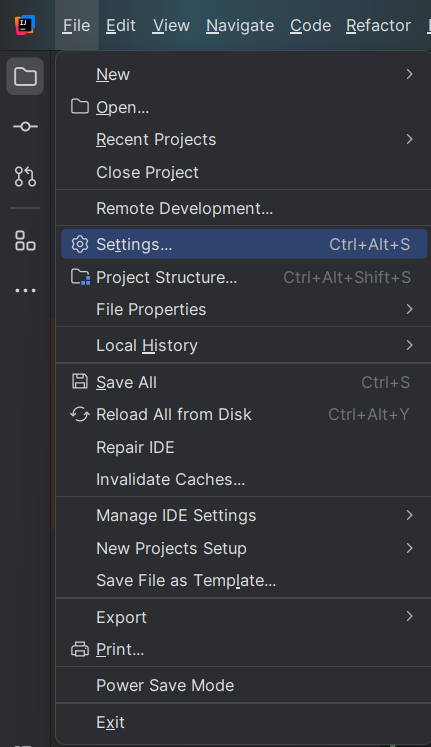
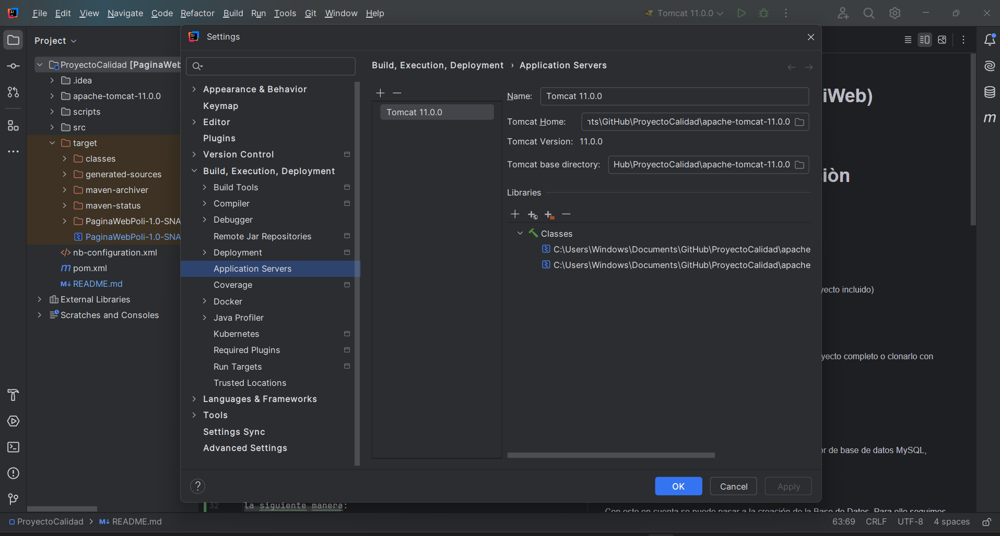
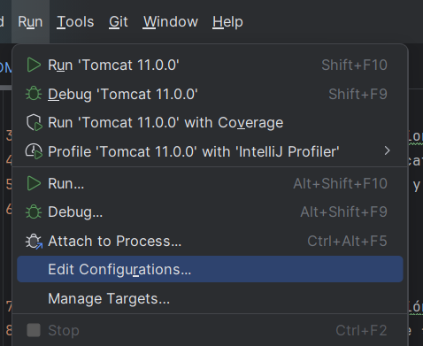
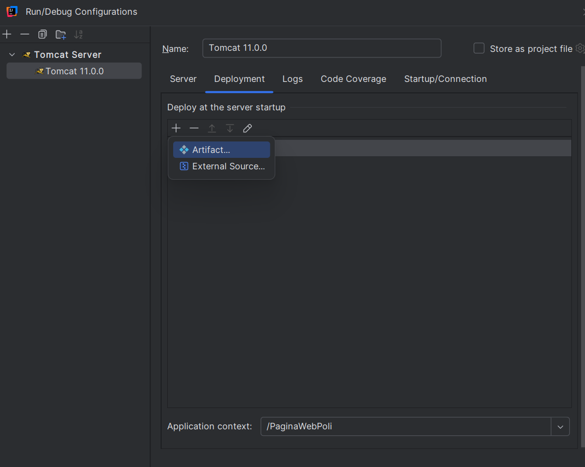

# Instalación y Configuración

## Versión
**Versión:** 1.1

## Requisitos

- Proyecto: **ProyectoCalidad**
- Mysql Server:  8.0.40
- Intellij: 2024.2.3
- TomCat: version 11.0.0 (Incluido)

**Nota:**
*Las rutas indicadas con corchetes angulares **<>** deben ser remplazadas y los corchetes eliminados*

## Descargar el Proyecto
Para configurar todo se necesita ya sea descargar el proyecto completo o clonarlo con Git del repositorio: `https://github.com/WooshC/ProyectoCalidad.git`

## MySQL
Para la base de datos se necesita tener instalado el gestor de base de datos
MySQL, tomando en cuenta la siguientes consideraciones:

- Al momento de instalar la base de datos la **contraseña del usuario root debe ser *1234***

Con esto en cuenta se puede pasar a la creación de la Base de Datos.
Para ello seguimos los siguientes pasos:
1. Iniciar MySQL Commad Line Client
2. Al iniciar nos pedira la clave del usuario root mencionado anteriormente
3. Ejecutar el scripts. Para ello en nuestor poryecto tenemos la carpeta llamada **scripts** la cual contiene el
    archivo *init.sql*
4. Identificado el archivo, copiamos su ruta de la computadora y en la CLI de MySQL ejecutamos el comando
    ```
    SOURCE <ruta/del/archivo.sql>;
    ```
5. Esto creará la base de datos y estara lista para ser utilizada

   

6. Para comprobar que se ha se creado la base de datos correctamente podemos realizar una consulta de
la siguiente manera:
    ```
   USE javaweb;
   SELECT * FROM cafeteria;
    ```

   

   
## TomCat
Para configurar el servidor TomCat en Intellij necesitamos  realizarlo de la siguiente manera:
1. Abrir el proyecto en Intellij
2. En la parte de **File** buscar la seccón **Settings**

   

3. En la ventana que se abre buscamos la seccion **Build, Execution, Deployment** y hacemos clic encima
4. En esta parte, buscamos la sección **Application server** y hacemos clic
5. En esta parte, añadimos un nuevo servidor, y en este seleccionamos la carpeta **apache-tomcat-11.0.0** ubicada en la raiz del proyecto
6. Finalmente aplicamos los cambios y salimos

    

7. Luego de esto, en el menú buscamos la sección **Run**
8. En el menú desplegable buscamos la parte de **Edit Configurations** y hacemos clic

   


9. Luego añadimos una nueva configuración, y buscamos la parte de *TomCat*
10. En esta parte seleccionamos de manera local y buscamos la parte de Deployment
11. En esta parte añadimos un **Deploy para iniciar la applicación**
12. Para añadir seleccionamos el *Artifcat* llamado **PaginaWebPoli.war**
    
    *Nota: Si el archivo no aparece o la opcion de añadir *Artifcat* tampoco, porfavor cerrar el IDE y volver a abrir el proyecto e intentarlo de nuevo. Con esta acción ya deberia aparecer los 2 elementos mencionados*

13. Terminado esto, se busca la sección *Application context* mas abajo de la misma sección y se borrar el war hastsa dejar el nombre como
**/PaginaWebPoli**

    

14. Terminado este proceso se applican los cambios y se coloca en **ok**
15. Terminado esto el boton de **Play** deberia activarse, y se ejecuta el proyecto

## Posibe Problemas
Si al realizar la configuración indicada salta un error de **SDK dañados** o parecidos, simplemente dar clic en la opción **fix it** que el propio IDE nos proprociona
Luego de esto el proyecto podria ejecutarse normalmente

Si se presentan otros problemas comunicarse lo mas antes posible con cualquier miembro del equipo