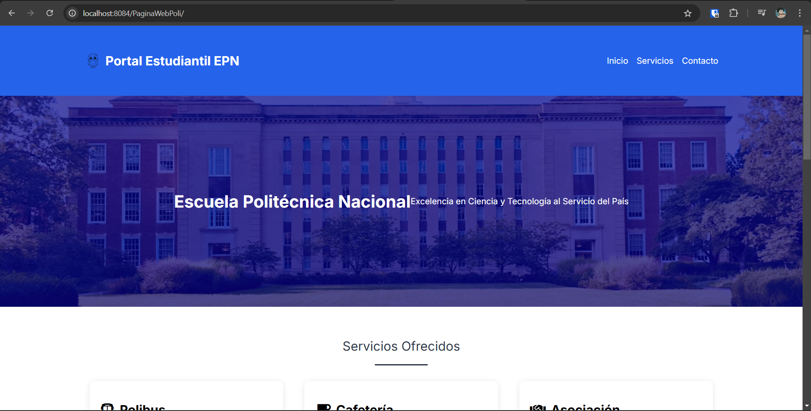

# Instalación y Configuración

**Proyecto:** Polizone

**Creador del Documento:** Defaz Joel

**Versión:** 1.4

## Requisitos

- Proyecto: **ProyectoCalidad**
- Docker Desktop
- IDE

## Descargar el Proyecto
Para configurar todo se necesita ya sea descargar el proyecto completo o clonarlo con Git del repositorio: `https://github.com/WooshC/ProyectoCalidad.git`
Una vez que se tenga el proyecto local, se puede abrir con alguna IDE para revisarlo, el equipo se ha manejado con estos dos IDEs:
- **IntelliJ IDEA**: Es el IDE principal, se puede descargar desde la página oficial de JetBrains
- **Visual Studio Code**: Es el IDE secundario, se puede descargar desde la página oficial de Visual Studio Code

# Despliegue
## Docker Desktop
Para este proyecto se va a desplegar con ayuda de Docker por lo que se necesita tener instalado *Docker Desktop*

Install Docker Desktop on Windows:`https://docs.docker.com/desktop/setup/install/windows-install/`

Una vez instalado podemos iniciar Docker Desktop para que todo funione correctamente

Luego de estos pasos previos podemos ejecutar el comando para levantar la aplicacion web de la siguiente manera:
1. Identificar los archivos:
Identificar el archivo *docker-compose-yml*
2. Identificado el archivo se verifica la ruta en la cual se encuentra y, ya sea con ayuda de la consola del IDE que se esté utilizando o con la cmd de Windows, ejecutar el siguiente comando para levantar la aplicacion web:
```
docker-compose up -d
```
   ***Nota: El flag "-d" nos sirve para evitar ver los logs de cada contenedor en la consola, pero si se quiere revisar el correcto funcionamiento de la misma se puede eliminar el flag***

3. Despues de esto esperamos un aproximado de 15 a 30 segundos hasta que la aplicación se levante por completo
4. Una vez esperado el tiempo aproximado, se puede ingresar al navegador web y abrir la siguiente dirección:
`http://localhost:8084/PaginaWebPoli/`

Si toda la configuración ha sido correcta deberia mostrarse la web

   

***NOTA: En el caso de que no se muestre la web o salga el mensaje "Esta pagina no funciona" o parecido, recargar la página hasta que la web sea visible***

## Pruebas o Inspección

Si se desea realizar algun cambio para realizar pruebas o inspeccionar el funcionamiento de la aplicación, se puede hacer de la siguiente manera:

1. Cambiar los archivos objetivo para las pruebas, por ejemplo el *"CafeteriaController"* para validar la funcionalidad de la cafeteria en dias festivos con la variable isWeekday cambiandolo a true o false
2. Una vez cambiado los archivos objetivo, se puede ejecutar el siguiente comando para levantar la aplicación con los cambios realizos
```
docker-compose down
```
Este comando nos permite bajar los contenedores y eliminarlos para que se vuelvan a levantar
3. Recomendable tambien eliminar manualmente los volumnes en la parte de "Volumenes" de Docker Desktop
4. Luego de verificar que se han eliminado los contenedores  y los volumenes con Dokcer Desktop podemos ejecutar el comando mencionado anteriormente para levantar la aplicación con los cambios realizados
```
docker-compose up -d
```

## Problemas
Si existe algun problema comunicarse con el equipo para poder solucionarlo